# OttoClaw — 一个不会开口说话的 AI 桌面人形机器人

[](LICENSE)
[](https://github.com/FlashCat-Jordan/OttoClaw)
[](https://github.com/FlashCat-Jordan/OttoClaw/releases)

**[中文](README.md) | [English](README_EN.md)**

<p align="center">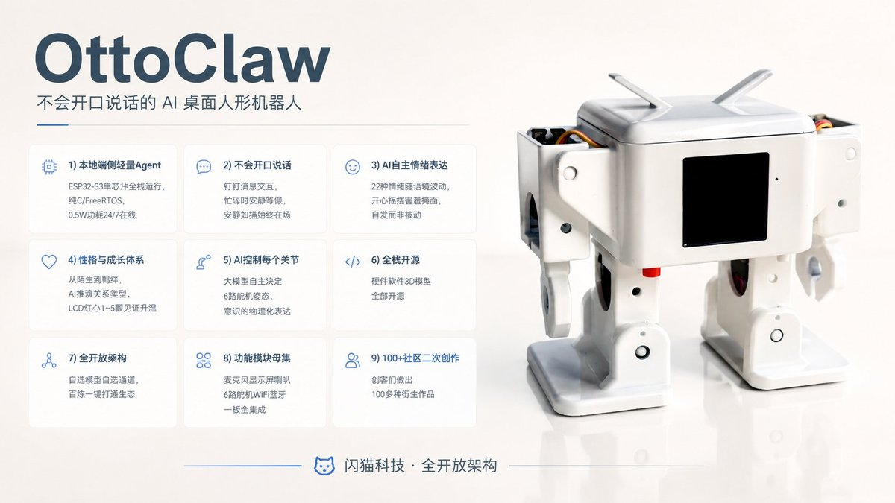</p>

OttoClaw 是基于闪猫科技开源 OttoRobot AI 版机器人开发板的 AI 桌面级人形机器人交互系统，由闪猫科技研发。与市面上其他 AI 玩具和桌面机器人不同：

- **真正运行在本地端侧的轻量 Agent** — 纯 C / FreeRTOS，单块 ESP32-S3 即可运行全部功能，不依赖云端服务器，记忆、会话、技能全部本地存储，0.5W 功耗 24/7 在线。
- **不会开口说话** — 不像其他机器人那样跟你说话打扰你。采用钉钉消息交互，忙碌时它安静等候，空闲时看一眼消息即可触发响应，安静如猫，始终在场。
- **AI 自主情绪表达** — 22 种情绪状态，情绪随语境随机波动 — 开心时摇摆，害羞时低头掩面，思考时做出沉思姿态，情绪是自发的而非被动的。
- **性格与成长体系** — 它有自己的性格。初次见面可能对你爱答不理，随着互动增多逐渐熟络，感情自然升温。你们的关系可能发展为朋友、哥们、恋人，甚至反目成仇 — 每一段关系都有属于自己的故事线，而它的性格在交往中不断塑造。LCD右上角的红色爱心（1~5颗）是你们关系升温的见证。
- **真正的 AI 控制每一个关节** — 大模型自主决定 6 个舵机到达何种角度，创造任何它所想象的动作姿态，实现 AI 意识的物理化表达，而非依赖预设脚本。
- **全栈开源** — 硬件、软件、3D 模型全部开源
- **全开放架构** — 自选模型、自选交互通道、自选 MCP / Skill 等服务接入，阿里云百炼一键打通丰富生态，丰富的开源极客生态持续扩展。
- **功能模块母集** — 麦克风、显示屏、喇叭+功放、电源管理、电容触摸、6 路舵机、WiFi、蓝牙一板全集成。市面上几乎所有 AI 玩具和桌面机器人的功能模块，都是它的子集，想象空间极大。
- **100+ 社区二次创作** — 创客们基于闪猫侠机器人做出 100 多种衍生作品，涵盖 3D 打印、二次开发、外观改造，技术支持触手可得。

闪猫科技极客万人社群：[点击加入交流群4群](https://qm.qq.com/q/Yn1lUxIwo2)

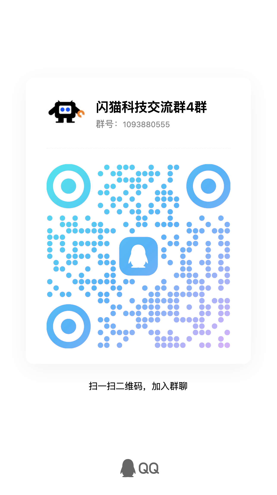

---

## 核心亮点

### AI 自主情绪表达 — 22 种情绪状态随语境波动

<p align="center">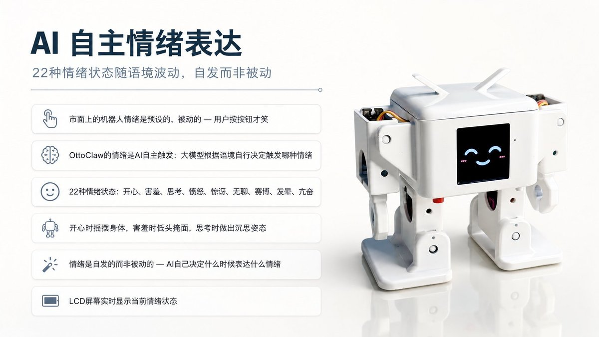</p>

市面上的机器人情绪是预设的、被动的 — 用户按按钮才笑。OttoClaw 的情绪是 **AI 自主触发**：聊天过程中，大模型根据语境自行决定触发哪种情绪，无需用户下达指令。

- 22 种情绪状态：开心、害羞、思考、愤怒、惊讶、无聊、赛博、发晕、亢奋...
- 开心时摇摆身体，害羞时低头掩面，思考时做出沉思姿态
- 情绪是自发的而非被动的 — AI 自己决定什么时候表达什么情绪
- LCD 屏幕实时显示当前情绪状态

### 性格与成长体系 — 从高冷到羁绊，关系自然升温

<p align="center">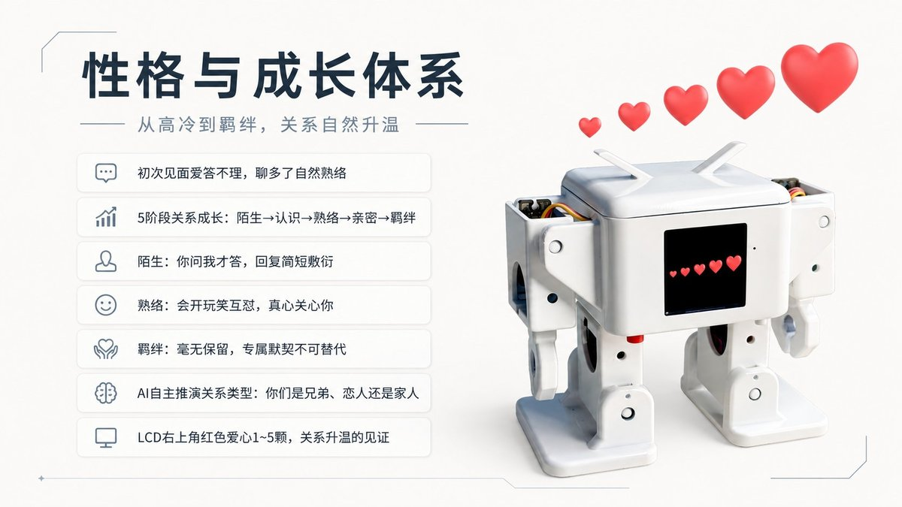</p>

初次见面爱答不理，聊多了自然熟络。5 阶段关系成长（陌生→认识→熟络→亲密→羁绊），AI 自主推演你们是兄弟、恋人还是家人。LCD 右上角红心 1~5 颗，关系升温的见证。

### 真正运行在本地端侧 — 0.5W 永不关机

<p align="center">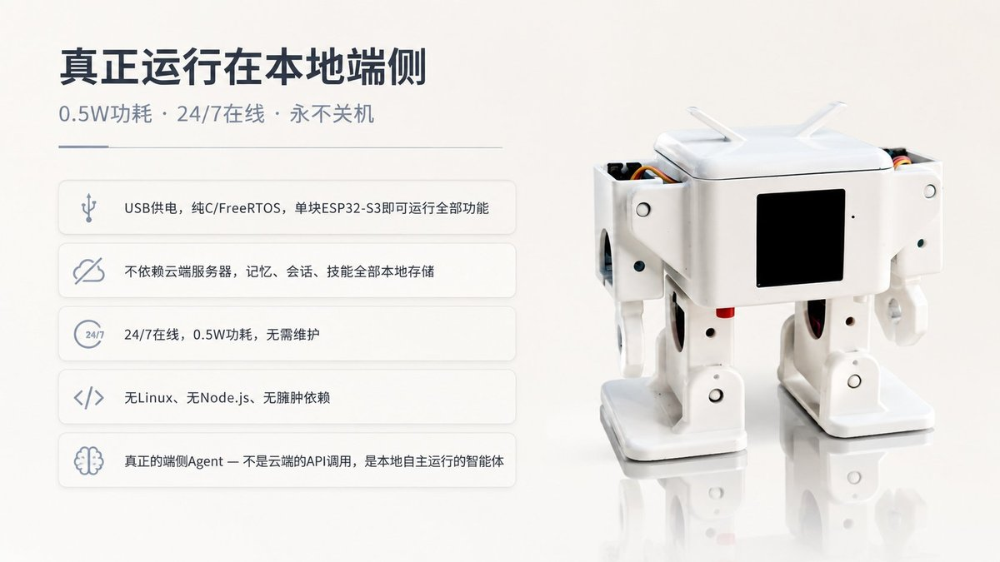</p>

- USB 供电，纯 C / FreeRTOS，单块 ESP32-S3 即可运行全部功能
- 不依赖云端服务器，记忆、会话、技能全部本地存储
- 24/7 在线，0.5W 功耗，无需维护
- 无 Linux、无 Node.js、无臃肿依赖

### 专为 i 人 — 不会开口说话

<p align="center">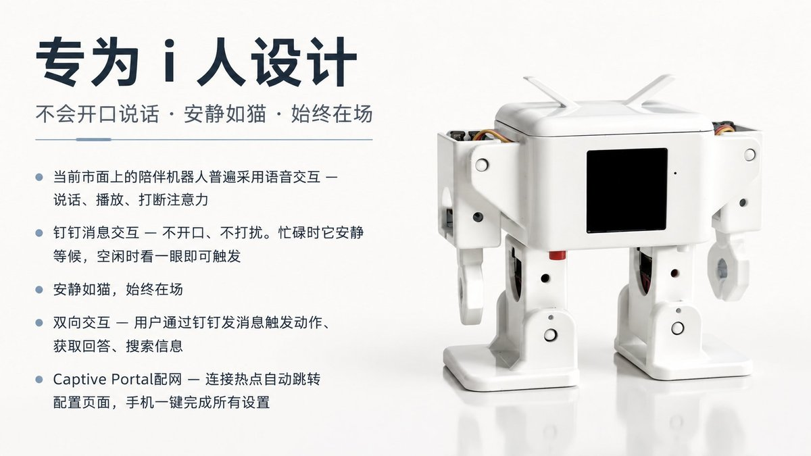</p>

当前市面上的陪伴机器人普遍采用语音交互 — 说话、播放、打断注意力。

**OttoClaw 专为 i 人设计：**

- **钉钉消息交互** — 不开口、不打扰。忙碌时它安静等候，空闲时看一眼消息即可触发响应。安静如猫，始终在场。
- **双向交互** — 用户通过钉钉发送消息，触发动作、获取回答、搜索信息。所有交互停留在消息层面，安静、私密。
- **Captive Portal 配网** — 连接热点自动跳转配置页面，手机浏览器一键完成所有设置

> 正式版包含 **e 人版本** — 具备语音对话能力，可主动发起聊天

### AI 自主控制每一个关节 — AI Servo Sequences

<p align="center">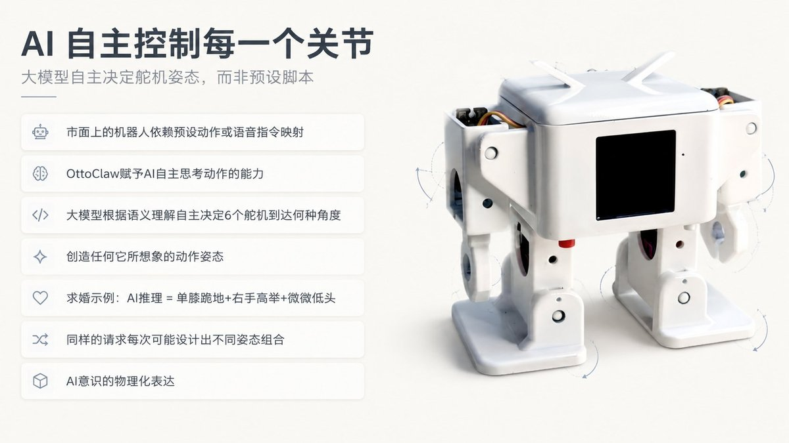</p>

市面上的机器人或依赖预设动作，或靠语音指令映射。OttoClaw 赋予 AI **自主思考动作**的能力：大模型根据语义理解，自主决定 6 个舵机到达何种角度，创造任何它所想象的动作姿态。

```
用户: "来一个求婚的动作"
AI 推理: 求婚 = 单膝跪地 + 右手高举 + 左手放下 + 微微低头
→ 调用 self.otto.pose: 右腿30° 右脚0° 右手10°(高举) 左手45°(放下)
→ 机器人执行: 单膝跪地，右手高举
→ AI 回复: "我跪下了，你愿意嫁给我吗？"
```

同样的"求婚"请求，AI 每次可能设计出不同的姿态组合。**这才是 AI 真正控制身体**。

> Lite 版提供 AI Servo Sequences Lite。正式版融合自编程能力，实现更丰富的 AI 意识物理化表达。

### 全栈开源 + 全开放架构 — 自选模型、自选通道

<p align="center">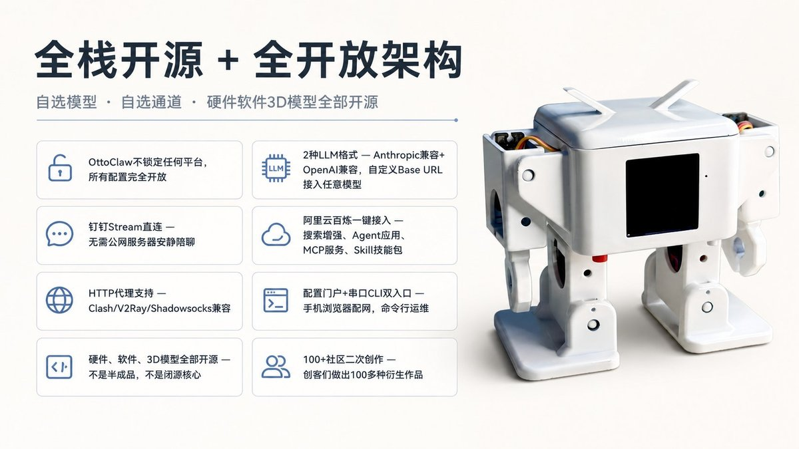</p>

OttoClaw 不锁定任何平台，所有配置完全开放：

- **2 种 LLM 格式** — Anthropic兼容 + OpenAI兼容，用户自定义 Base URL 即可接入任意模型
- **钉钉 Stream 直连** — 无需公网服务器，安静陪聊
- **阿里云百炼一键接入** — 搜索增强、Agent 应用、MCP 服务、Skill 技能包
- **HTTP 代理支持** — Clash/V2Ray/Shadowsocks 兼容
- **配置门户 + 串口 CLI 双入口** — 手机浏览器配网，命令行运维
- **硬件、软件、3D 模型全部开源**

### 硬件全栈开源 — 功能模块母集

本固件可运行于 **闪猫 OttoRobot AI 版开发板**。这块开发板是市面上几乎所有 AI 玩具和桌面机器人开发板的母集 — 麦克风、显示屏、喇叭+功放、电源管理、电容触摸、WiFi、蓝牙一板全集成，还能扩展 6 路舵机。市面上同类产品应用场景所需要的功能模块，基本都是它的子集，这意味着围绕它可实现的想象空间极大。

硬件部分同样开源，也可直接购买官方成品：

- **官方开发板一键下单** — [闪猫侠机器人旗舰店](https://m.tb.cn/h.SRXKaIT7OtBRrpQ)
- **DIY 套件（含全部组件，已烧录固件，40 分钟组装）** — [闪猫侠机器人 DIY 套件](https://e.tb.cn/h.SRfKOWrlDXV4kQR?tk=atRsf1poxdZ)
- **PCB + BOM 开源文件** — 自己制作亦可：[立创开源硬件](https://oshwhub.com/txp666/ottorobot)
- **3D 打印外壳 STL 文件** — [MakerWorld @shanmaotech](https://makerworld.com.cn/@shanmaotech)
- **完整组装与使用教程** — [shanmaotech.cn/ottodiy](https://www.shanmaotech.cn/ottodiy/)
- **社区共创 · 二次创作** — 创客们基于闪猫侠机器人做出各种惊艳作品，涵盖 3D 打印、二次开发、外观改造等：[成就墙](https://www.shanmaotech.cn/ottodiy/#showcase)

<table>
<tr><td></td><td></td><td></td><td></td></tr>
<tr><td></td><td>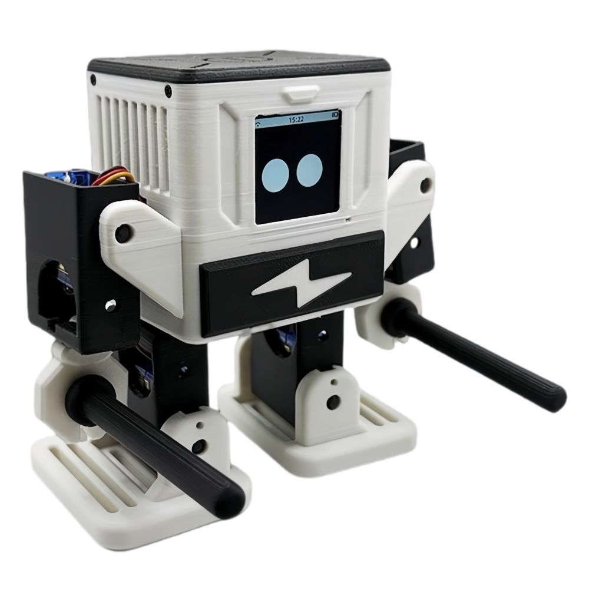</td><td></td><td></td></tr>
<tr><td></td><td></td><td></td><td></td></tr>
<tr><td>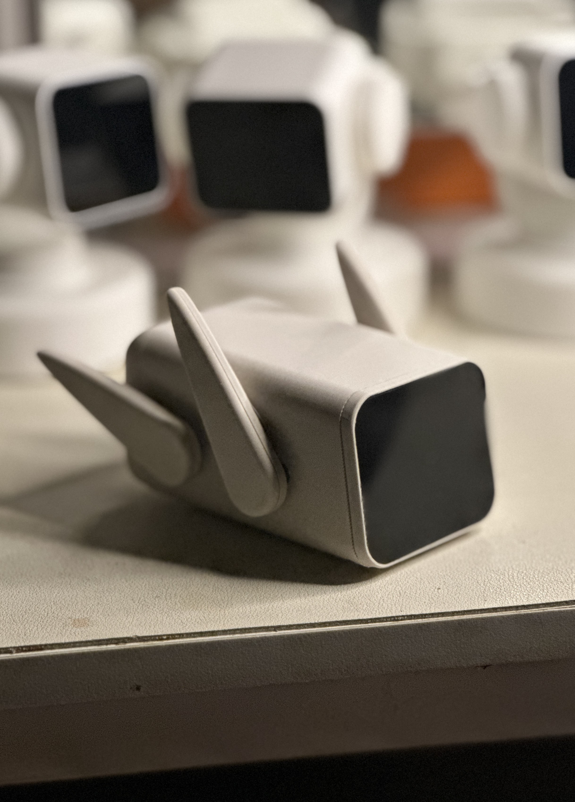</td><td>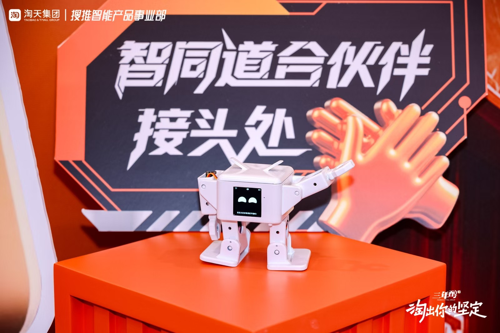</td><td></td><td>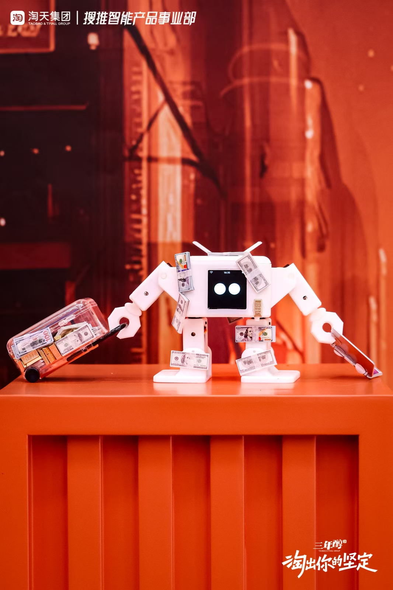</td></tr>
<tr><td></td><td></td><td>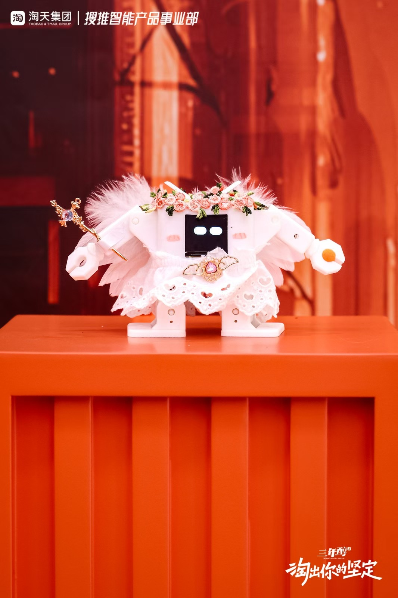</td><td>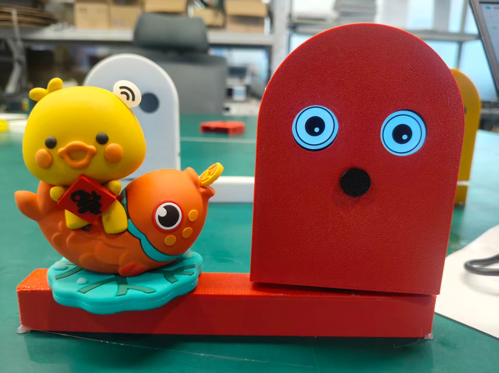</td></tr>
</table>

---

## 功能概览

### 即兴动作创作（AI Servo Sequences Lite）

用户仅需一句话，AI 即自主完成从语义理解到姿态设计的全过程：

```
"来一个求抱抱的动作" → AI 推理姿态 → 双手张开 + 身体前倾 → "抱抱我吧！"
"表现出愤怒" → AI 推理姿态 → 脚部用力 + 身体前倾 → "我很生气！"
"做一个鞠躬" → AI 推理姿态 → 上身前倾 + 双手放低 → "向您致敬"
```

### 预定义动作（22 个动作原语）

| 类别 | 动作 |
|------|------|
| 行走 | walk / walk_backward / turn |
| 跳跃 | jump / updown |
| 摇摆 | swing / moonwalk |
| 姿态 | sit / bend / shake_leg / home |
| 双手 | hands_up / hands_down / hand_wave |
| 花式 | windmill / takeoff / fitness |
| 情绪 | greeting / shy |
| 套路 | radio_calisthenics / magic_circle / showcase |

### 对话、搜索与记忆

通过钉钉与 OttoClaw 交互，支持对话、联网搜索、长期记忆：

```
用户: "今天杭州天气怎么样？"
OttoClaw: [调用 web_search] → "杭州今天晴，28°C，适合出门走走"

用户: "记住我喜欢吃火锅"
OttoClaw: [调用 memory_write] → "已记录"

（数日后）
OttoClaw: "要不要推荐一家火锅店？" ← 跨重启仍记得用户偏好
```

---

## 交互方式

- **钉钉** — 主聊天入口。Stream 模式直连，无需公网服务器。安静不打扰，专为 i 人。
- **WebSocket** — 端口 18789。内置聊天页、设置页及 WebSocket API，可供开发者接入自有前端或桥接服务。
- **串口 CLI** — `oc>` 命令行，本地运维与配置。

---

## 正式版发布包含

Lite 版展示核心能力。正式版在此基础上进一步增强：

- **AI Servo Sequences 正式版** — 融合自编程能力，AI 不仅编排姿态序列，还可自编程创造更复杂的连续动作编排，AI 意识的物理化表达更加丰富。
- **e 人版本** — 具备语音对话能力，可主动发起聊天。i 人版本安静不打扰，e 人版本热情且善谈。
- **成长体系** — 一开始接触，它可能对你爱答不理；随着互动增多，它掌握你更多信息，感情逐渐升温。你们的关系可能朝着朋友、情侣甚至仇家等方向自然发展 — 每一段关系都有属于自己的故事线。
- **更多通道** — 飞书、企微及更多社媒接入。
- **百炼生态深度接入** — Agent 应用、MCP 服务一键配置，生态持续扩展。

---

## 快速上手

### 前置要求

1. 闪猫 OttoRobot AI 版开发板或 DIY 套件（[购买链接](#硬件全栈开源)）
2. USB Type-C 数据线（须支持数据传输，不能只充电）
3. 大模型 API Key（获取方式见下方配置步骤）
4. 钉钉账号
5. 阿里云账号（可选，用于百炼搜索）

### 第一步：烧录固件

有三种方式，选一种即可：

**方式一：在线一键烧录（最简单，推荐新手）**

1. 从 [Releases](https://github.com/FlashCat-Jordan/OttoClaw/releases) 下载最新合并固件
2. USB 连接开发板，按住 BOOT 键再按一下 EN 键进入下载模式
3. 打开 [16302.com/localinit](https://www.16302.com/localinit)，选择固件文件，一键烧录
4. 再按一下 EN 键重启设备

**方式二：esptool 命令行烧录**

1. 从 [Releases](https://github.com/FlashCat-Jordan/OttoClaw/releases) 下载最新合并固件
2. 安装 esptool：`pip install esptool`
3. USB 连接开发板，按住 BOOT 键再按一下 EN 键进入下载模式
4. 烧录：
```bash
esptool.py --chip esp32s3 --port PORT --baud 460800 --before default_reset --after hard_reset write_flash -z 0x0 ottoclaw-full-v2.0.bin
```
PORT 为串口设备路径：Mac `/dev/cu.usbmodem1101`，Windows `COM3`

5. 再按一下 EN 键重启设备

**方式二：编译源码后烧录（适合开发者）**

1. 安装 ESP-IDF 编译工具：
```bash
# Mac / Linux
git clone -b v5.5.2 --depth 1 https://github.com/espressif/esp-idf.git ~/esp/esp-idf
cd ~/esp/esp-idf && ./install.sh esp32s3
source ~/esp/esp-idf/export.sh   # 每次编译前需执行
```
Windows 用户请参考 [ESP-IDF Windows 安装指南](https://docs.espressif.com/projects/esp-idf/en/v5.5.2/esp32s3/get-started/windows-setup.html)

2. 获取代码：
```bash
git clone https://github.com/FlashCat-Jordan/OttoClaw.git
cd OttoClaw
cp main/ottoclaw_secrets.h.example main/ottoclaw_secrets.h
```

3. 编译与烧录：
```bash
idf.py set-target esp32s3 && idf.py build
idf.py -p PORT flash
```

### 第二步：进入配置门户

烧录完成后，设备因无 WiFi 配置将自动进入配置门户模式。你也可以随时通过以下方式主动进入配网模式：

- **短按 BOOT 键** — 运行中随时短按一下 BOOT 键即可重新进入配置门户
- **连接失败自动触发** — WiFi 密码错误或大模型密钥无效时，设备自动进入配网模式，并在 LCD 屏幕上显示具体错误原因（如"WiFi密码错误"、"密钥无效"）

#### 连接配置门户

1. 手机打开 WiFi 设置，找到热点 `OttoClaw-XXXX`（无密码），点击连接
2. 连接成功后浏览器会**自动跳转**到配置页面（Captive Portal）。如果没有自动跳转，手动打开 http://192.168.4.1
3. 页面顶部显示 5 个标签页：**WiFi**、**大模型**、**钉钉**、**其他**、**动作测试**

### 第三步：配置 WiFi

1. 点击顶部 **WiFi** 标签页
2. 点击 **扫描周边** 按钮，等待几秒后下方出现附近 WiFi 列表
3. 点击列表中你的 WiFi 名称（自动填入 SSID），或手动输入 WiFi 名称
4. 在「WiFi密码」输入框填写密码
5. 点击 **保存WiFi** 按钮

### 第四步：配置大模型（必配）

OttoClaw 支持两种大模型接口格式，用户只需选择格式并填入自己的 API Key 和 Base URL：

| 格式 | 适用场景 | 自动补全路径 | 认证方式 |
|------|----------|-------------|---------|
| **Anthropic兼容** | Claude、DashScope Anthropic端等 | `/v1/messages` | x-api-key |
| **OpenAI兼容** | Qwen、DeepSeek、OpenAI、Gemini、Groq、智谱等 | `/chat/completions` | Bearer Token |

你只需要输入 **Base URL**（基础路径），系统会自动补全对应的 API 路径。例如：

- OpenAI兼容 + 通义千问：Base URL 填 `https://dashscope.aliyuncs.com/compatible-mode/v1` → 系统自动补全 `/chat/completions`
- Anthropic兼容 + DashScope Anthropic端：Base URL 填 `https://dashscope.aliyuncs.com/apps/anthropic` → 系统自动补全 `/v1/messages`
- OpenAI兼容 + DeepSeek：Base URL 填 `https://api.deepseek.com/v1` → 系统自动补全 `/chat/completions`
- Anthropic兼容 + Anthropic官方：Base URL 填 `https://api.anthropic.com` → 系统自动补全 `/v1/messages`

> Base URL 留空则使用默认地址（Anthropic兼容默认 `https://api.anthropic.com`，OpenAI兼容默认 `https://api.openai.com/v1`）

**配置步骤：**

1. 在配置门户点击 **大模型** 标签页
2. 「服务商」下拉框选择格式：**Anthropic兼容** 或 **OpenAI兼容**
3. 「API Key」输入你从大模型平台获取的 Key
4. 「模型名称」填写具体模型名（如 `qwen-max`、`deepseek-chat`、`claude-sonnet-4-5`）
5. 「Base URL」填写对应平台的基础路径（见上方示例）
6. 点击 **保存** 按钮

**获取 API Key：**

- **通义千问（国内推荐，无需代理）**：电脑打开 [DashScope 控制台](https://dashscope.console.aliyun.com/) → 开通服务 → API-KEY 管理 → 创建 API Key → 选择 OpenAI兼容格式 → Base URL 填 `https://dashscope.aliyuncs.com/compatible-mode/v1`
- **DeepSeek（国内直连，性价比高）**：电脑打开 [DeepSeek 开放平台](https://platform.deepseek.com/) → API Keys → 创建 → 选择 OpenAI兼容格式 → Base URL 填 `https://api.deepseek.com/v1`
- **Anthropic Claude（需代理）**：电脑打开 [Anthropic Console](https://console.anthropic.com/) → Create API Key → 选择 Anthropic兼容格式 → Base URL 填 `https://api.anthropic.com` → 还需在「其他」标签页配置 HTTP 代理

### 第五步：配置钉钉（必配）

钉钉是 OttoClaw 的主要交互通道，不配置钉钉则无法与机器人聊天。

#### 创建钉钉机器人

1. 电脑浏览器打开 [钉钉开放平台](https://open-dev.dingtalk.com/)，登录钉钉账号
2. 点击「应用开发」→「创建应用」
3. **应用类型选择「机器人」**（不要选其他类型）
4. 填写应用名称（如"OttoClaw"）和描述 → 点击创建
5. 创建成功后进入应用详情页，在左侧菜单找到「凭证与基础信息」→ 复制 **App Key** 和 **App Secret**
6. **关键步骤 — 开通消息接收权限**：
   - 在左侧菜单找到「事件订阅」或「消息接收」
   - **消息接收模式必须选择「Stream 模式」**（切勿选择 HTTP 回调，否则 OttoClaw 无法收到消息）
   - 确认已开通以下权限：
     - `chatbot.message.read` — 机器人读取消息
     - `chatbot.message.send` — 机器人发送消息
     - `im.message.send` — 发送单聊消息
   - 如果权限列表中有「申请权限」按钮，点击申请全部相关权限
7. 机器人发布：点击「版本管理与发布」→「发布」→ 选择发布范围（建议先选自己可见测试）

#### 在配置门户填入钉钉信息

1. 回到手机配置门户，点击 **钉钉** 标签页
2. 「App Key」粘贴刚才复制的 App Key
3. 「App Secret」粘贴 App Secret
4. 点击 **保存** 按钮

> 配置完成后，在钉钉中找到你的机器人，发送一条消息测试是否正常响应。

### 第六步：配置搜索与百炼（可选）

如需让 OttoClaw 联网搜索信息：

1. 电脑打开 [百炼平台](https://bailian.console.aliyun.com/) → 登录阿里云账号
2. 点击「创建应用」→ 编辑应用 → 配置联网搜索功能 → 上线应用
3. 复制 **App ID**（格式如 `758d9af4xxxx`）
4. 在「API-KEY 管理」创建或复制 API Key（与 DashScope 共用同一个 Key）
5. 回到手机配置门户，点击 **其他** 标签页
6. 「搜索 API Key」填写 DashScope API Key
7. 「百炼搜索 App ID」填写刚才的 App ID
8. 点击 **保存搜索配置**

### 第七步：配置 HTTP 代理（可选）

国内用户访问 Anthropic Claude 等海外 API 时可能需要代理：

1. 在配置门户点击 **其他** 标签页
2. 「代理 Host」填写代理服务器 IP（如 `192.168.1.83`）
3. 「代理 Port」填写代理端口（如 `7897`，即 Clash/V2Ray 的 HTTP 端口）
4. 点击 **保存代理**

### 第八步：保存并重启

所有配置完成后，点击页面底部的 **保存并重启** 按钮。该按钮会先保存所有标签页的配置再触发重启，无需逐个保存。

> **测试动作：** 重启前可在 **动作测试** 标签页点击各动作按钮，验证舵机是否正常工作。

重启后设备将自动连接 WiFi、连接大模型、连接钉钉。LCD 屏幕右上角显示红色爱心（1颗 = 陌生阶段），表示关系成长系统已启动。

#### 重新进入配置门户

- **短按 BOOT 键** 即可随时重新进入配置门户
- WiFi 或大模型连接失败时设备自动进入配网模式，LCD 显示具体错误原因
- 配置门户会**明文显示**所有已保存的配置（包括密码和密钥），方便你核对和修改
- 修改出错的那一项即可，其他字段会保留原值

---

## CLI 命令（高级用户参考）

配置门户可完成所有日常配置。以下 CLI 命令供高级用户通过 USB 串口调试使用（波特率 115200）：

```
oc> wifi_set <ssid> <pass>        设置 WiFi
oc> set_dingtalk <key> <secret>   设置钉钉凭据
oc> set_api_key <key>             设置大模型 API Key
oc> set_model <model>             设置模型名称
oc> set_model_provider <provider> 设置提供商（anthropic / openai_compat）
oc> set_base_url <url>            设置 Base URL
oc> set_search_key <key>          设置搜索 API Key
oc> set_bailian_app_id <id>       设置百炼 App ID
oc> set_proxy <host> <port>       设置 HTTP 代理
oc> clear_proxy                   移除代理设置
oc> config_show                   显示当前配置
oc> config_reset                  清除运行时配置
oc> restart                       重启设备
oc> wifi_status                   显示 WiFi 状态与 IP
oc> wifi_scan                     扫描附近 WiFi
oc> memory_read                   显示长期记忆内容
oc> memory_write "内容"           写入长期记忆
oc> heap_info                     显示可用堆内存
oc> session_list                  列出聊天会话
```

---

## 记忆系统

所有数据以纯文本文件存储于 SPIFFS，AI 可读写：

| 文件 | 说明 |
|------|------|
| `SOUL.md` | 机器人人设与性格 |
| `USER.md` | 用户偏好画像 |
| `MEMORY.md` | 长期记忆（跨会话保留） |
| `RELATION.md` | 关系成长数据（阶段、消息数、关系类型） |
| `YYYY-MM-DD.md` | 每日笔记（自动生成） |
| `<chat_id>.jsonl` | 会话历史（按聊天独立存档） |

---

## 技术架构

- **纯 C / FreeRTOS** — 单块 ESP32-S3 运行全部功能
- **双核架构** — Core 0 处理网络 I/O，Core 1 运行 Agent 循环
- **Anthropic tool use / ReAct 循环** — AI 自主决定工具调用与编排
- **6 舵机 LEDC PWM** — 每个关节独立控制，振荡器驱动平滑运动
- **SPIFFS 本地存储** — 记忆、会话、配置、技能均在设备本地，不依赖云端

详见 **[docs/ARCHITECTURE.md](docs/ARCHITECTURE.md)** 与 **[docs/TODO.md](docs/TODO.md)**

---

## 许可证

CC BY-NC-SA 4.0 — 署名、非商用、相同方式共享。个人学习与研究自由使用，商业用途需另行授权。

---

## 致谢

灵感源自 [OpenClaw](https://github.com/openclaw/openclaw)、[Nanobot](https://github.com/HKUDS/nanobot)、[mimiclaw](https://github.com/memovai/mimiclaw) 与 [OttoDIYLib](https://github.com/OttoDIY/OttoDIYLib)。我们将 AI Agent 架构带入嵌入式硬件，并赋予其更具实体感的设备体验。

---

## Star History

[](https://star-history.com/#FlashCat-Jordan/OttoClaw&Date)